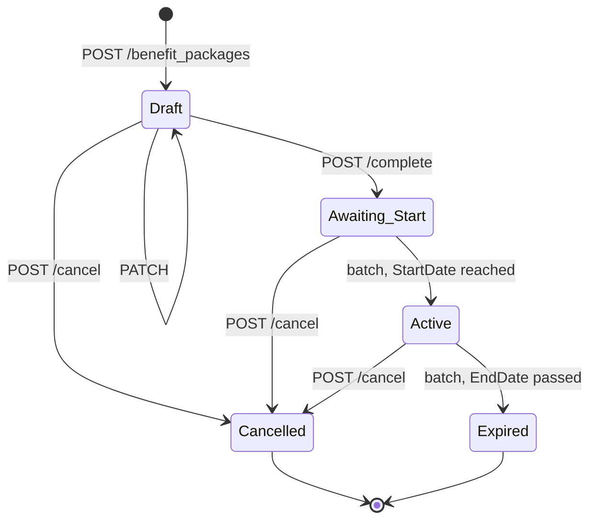
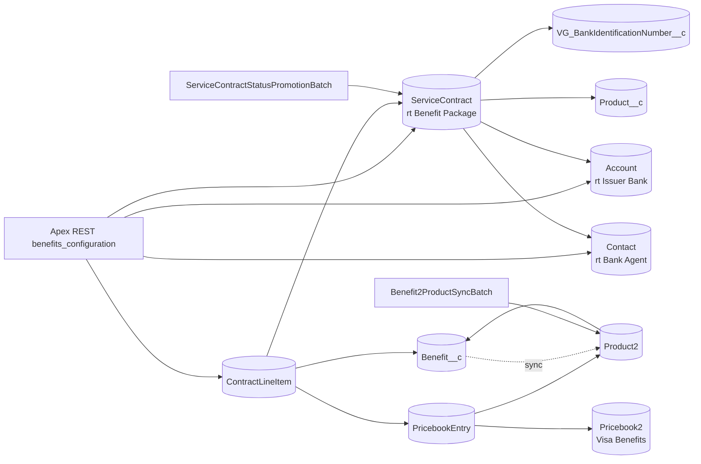
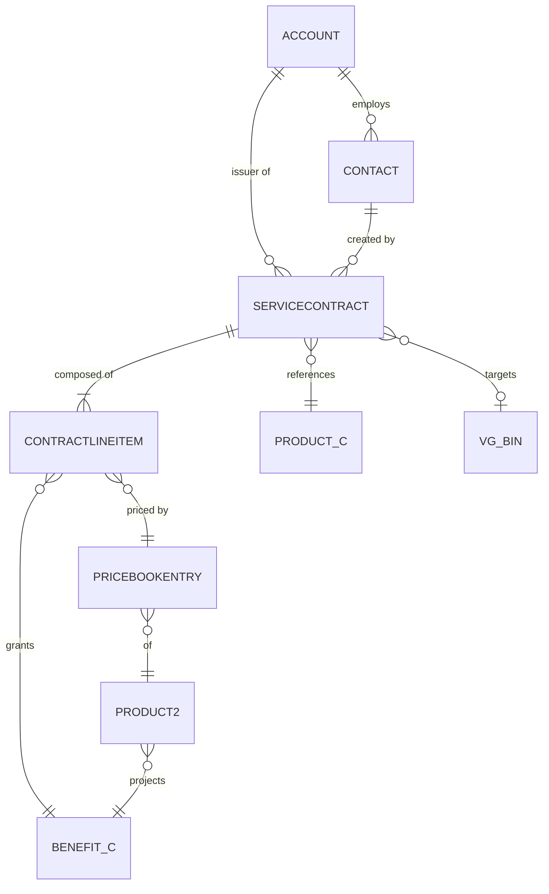

# Benefit Packages Data Model Architecture - Back-end

| Status | Domain | Author | Date | Version |
|---|---|---|---|---|
| Draft | Data model | Adilson Arcoverde — Application Architect | 2026-07-25 | 1.5 |

---

## Decision context

The Visa Benefits Configuration capability lets an **issuer bank agent** assemble a
**benefit package**: a set of core and optional benefits attached to a card portfolio,
applied to a range of card accounts, effective between two dates, and billed per quarter.

The capability is delivered through the `benefits_configuration` API family, whose contract
is fixed by four OpenAPI documents already published by the API governance team:

| Contract file | Resource | Operations |
|---|---|---|
| `benefit_packages.openapi.yaml` | `/benefits_configuration/vexp/benefit_packages` | POST, GET (list), GET (detail), PATCH, POST `/cancel`, POST `/complete` |
| `products.openapi 4.yaml` | `/benefits_configuration/vexp/products` | GET |
| `banks.openapi.yaml` | `/benefits_configuration/vexp/banks/{bank_id}` | GET |
| `banks__id__agents.openapi.yaml` | `/benefits_configuration/vexp/banks/{bank_id}/agents/{agent_id}` | GET |

The user experience is defined by the **New package** flow of the MVP design file
(section `803:14437`, page `MVP [06.17.2026]`): name the package → select the accounts
(BIN and account range) → review the core benefits and select
the optional ones with per-card pricing → choose package information (start date, quarter,
renewal, billing) → review the estimated total cost → accept the *Benefit coverage service
agreement* → receive an activation number.

### Confirmed premises

1. **Salesforce is the system of record.** The endpoints of the contract are implemented as
   inbound Apex REST resources behind the API gateway; the benefit package is persisted in
   the org. No outbound call to a third-party backend participates in the write path.
2. **The actor is an issuer bank agent**, identified by claims carried in the access token.
   The agent is not a Salesforce user; the API runs under an integration identity and the
   agent identity is resolved from the token. The authorization pipeline is specified in
   `20260725-AXA-ADR-VOBP-architecture-of-benefits-configuration-endpoints-backend.md`.
3. **Standard objects are preferred**, and the pair chosen for the package is
   `ServiceContract` + `ContractLineItem`. The org's user base holds Service Cloud licences,
   which include Entitlement Management — the feature that exposes these two objects.
4. **The data model is a superset of the contract.** Attributes that exist in the New package
   flow but not in the OpenAPI v1 contract (package name, portfolio, account funding source,
   BIN, renewal type, billing frequency, billing quarter, estimated cost, agreement
   acceptance, activation number) are modelled now and marked as not exposed by v1.
5. **`amount_of_policies` is agent-declared**, not derived. The platform persists the value
   received and does not reconcile it against existing card data.
6. **The identifier exposed on the boundary is the Salesforce 18-character record Id** for the
   package, the bank and the agent. `benefit_id` is the exception and carries the Visa external
   reference the catalogue already holds.

### Problems in the current state that motivate the decision

1. **No package concept exists in the org.** The benefit catalogue is modelled by the custom
   objects `Product__c`, `Benefit__c` and `Certificate_Definition__c`, and the issued coverage
   by `Certificates__c` and `MN_Account_BIN__c`. There is no object holding a *configuration
   intent* — a set of benefits an issuer offers to a range of accounts for a future period.
   Without it, the five business states of the contract have nowhere to live.
2. **The catalogue has no commercial layer.** `Benefit__c` carries content (names, templates,
   descriptions per language) but no price per card, no coverage type and no currency, while
   the `products` contract returns `cost` with three coverage shapes (`SIMPLE`, `USAGE`,
   `PERIOD`) and the New package flow computes an estimated total from per-card prices.
3. **BIN data is descriptive, not transactional.** `VG_BankIdentificationNumber__c` describes
   a BIN (issuer name, country, product name, product type) but does not carry an account
   number range, which the contract requires as `affected_policy_range`.
4. **Issuer banks are not distinguishable from cardholders.** `Account` is used today for
   cardholders (`Customer_Identifier__c`, `partner_cd__c`, `Inactive__c`). Nothing separates an
   issuer bank record from a cardholder record, so the `banks/{bank_id}` contract has no
   backing record type.

---

## Decisions

### 1. Object selection strategy: standard first, existing custom catalogue second

The model is built in three layers, and the layer decides the object type:

| Layer | Objects | Rationale |
|---|---|---|
| Package (transaction) | `ServiceContract`, `ContractLineItem` | Standard. Native header/line lifecycle, native currency roll-ups, native activation number, no new object to maintain. |
| Commercial catalogue | `Product2`, `Pricebook2`, `PricebookEntry` | Standard. Mandatory dependency of `ContractLineItem`, and the only native place for a per-card price with currency. |
| Content catalogue and card data | `Product__c`, `Benefit__c`, `VG_BankIdentificationNumber__c` | Existing custom objects, reused as-is. Recreating the benefit catalogue as `Product2` alone would fork the source of truth used by 1,000+ Apex classes. |
| Parties | `Account`, `Contact` | Standard, distinguished by record type. |

**No new custom object is created.** Every attribute of the contract and of the New package
flow lands on a standard object as a standard field or a custom field. This is the decisive
argument for `ServiceContract`: the header/line pair, the `Subtotal`/`TotalPrice`/`GrandTotal`
roll-ups, the `ContractNumber` auto-number, the `StartDate`/`EndDate`/`Term` triple and
the `AccountId`/`ContactId` relationships are all platform-maintained, so the estimated cost
shown on the review screen requires no Apex aggregation and no roll-up summary field.

`Order` + `OrderItem` and `Contract` + a custom child were both discarded. `Order` brings an
order-fulfilment lifecycle — activation, reduction orders, order products with delivery schedules —
that carries no meaning for a benefit configuration, and its `StatusCode` offers only the `Draft`
and `Activated` categories, so `Cancelled` and `Expired` would have no category to map onto.
`Contract` has no standard line-item child at all, so it would force a custom child object and
lose the native cost roll-ups — the single strongest reason to use a standard pair here.

### 2. `ServiceContract` (record type `Benefit Package`) is the package header

A dedicated record type isolates benefit packages from any other service contract usage in
the org, and gives the page layout, the picklist value sets and the validation rules a scoping
key.

| Contract / flow attribute | Salesforce field | Type | Notes |
|---|---|---|---|
| `benefit_package_id` | `Id` | Id (18) | Read-only, platform-generated. See decision 6. |
| Package name (flow only) | `Name` | Text(255) | Standard. Flow example: `Gold 400102`. |
| Activation number (flow only) | `ContractNumber` | Auto Number | Standard, read-only. Displayed on the activation confirmation screen. |
| `status` | Package Status (`Package_Status__c`) | Picklist | `Draft`, `Awaiting Start`, `Active`, `Cancelled`, `Expired`. Source of truth for the API. See decision 5. |
| — | `Status` | Picklist | Standard, **read-only and platform-derived** (`Inactive`, `Active`, `Expired`). Neither written nor read by this solution. `ServiceContract` has no `StatusCode` field. |
| `product_reference` | Product Reference (`Product_Reference__c`) | Text(10) | Contract value, e.g. `I_C_BR`. Indexed as External Id for catalogue lookup. |
| `product_reference` (resolved) | Product (`Product__c`) | Lookup(`Product__c`) | Link to the existing content catalogue. Populated by Apex from `Product_Reference__c`. |
| `active_start_at` | `StartDate` | Date | Standard. |
| `active_end_at` | `EndDate` | Date | Standard. |
| — | `Term` | Number(4,0) | Standard. Whole months between `StartDate` and `EndDate`, set by Apex on write. |
| `amount_of_policies` | Amount of Policies (`Amount_of_Policies__c`) | Number(9,0) | Agent-declared, minimum 1. Drives `ContractLineItem.Quantity`. |
| `affected_policy_range.external_number_start_at` | Policy Range Start (`Policy_Range_Start__c`) | Text(10) | |
| `affected_policy_range.external_number_end_at` | Policy Range End (`Policy_Range_End__c`) | Text(10) | |
| Portfolio (flow only) | Portfolio (`Portfolio__c`) | Picklist | `Consumer`, `Business`, `Commercial`. |
| Account funding source (flow only) | Account Funding Source (`Account_Funding_Source__c`) | Picklist | `Credit`, `Debit`, `Prepaid`. |
| BIN (flow only) | Bank Identification Number (`Bank_Identification_Number__c`) | Lookup(`VG_BankIdentificationNumber__c`) | **Required.** The backend requires the BIN to exist; the *Without BIN* variant of the prototype is out of scope. See decision 12. |
| Renewal (flow only) | Renewal Type (`Renewal_Type__c`) | Picklist | `Automatic`, `Manual`. Default `Automatic`. |
| Billing (flow only) | Billing Frequency (`Billing_Frequency__c`) | Picklist | `Quarterly`. Single value in the MVP, modelled as a picklist so the value set can grow without a schema change. |
| Quarter start date (flow only) | Billing Quarter (`Billing_Quarter__c`) | Picklist | `Q1`, `Q2`, `Q3`, `Q4`. |
| Estimated total cost (flow only) | `TotalPrice` | Currency | Standard roll-up of the lines. See decision 9. |
| Total cost per benefit (flow only) | Cost per Account (`Cost_per_Account__c`) | Formula(Currency) | `TotalPrice / Amount_of_Policies__c`, guarded against division by zero. |
| Issuer bank | `AccountId` | Lookup(`Account`) | Record type `Issuer Bank`. Row-level scoping key of every query. |
| Acting agent | `ContactId` | Lookup(`Contact`) | Resolved from the token claims at creation time. |
| Agreement acceptance | Agreement envelope field set | — | Acceptance is a **signature**, not a checkbox. The instant, the signer and the template version live in `Agreement_Signed_At__c`, the envelope recipients and `Agreement_Template_Version__c`, defined in decision 13 of `20260725-AXA-ADR-VOBP-architecture-of-agreement-signature-backend.md`. `Terms_Accepted_At__c`, `Terms_Accepted_By__c` and `Terms_Version__c` are superseded and not created. |
| Signature gate | Activation Hold Reason (`Activation_Hold_Reason__c`) | Text(255) | Why a package that reached its start date did not activate — normally an unsigned agreement. Written by the promotion batch, decision 11. |
| — | Completed At (`Completed_At__c`) | DateTime | Set by the `/complete` operation. |
| — | Cancelled At (`Cancelled_At__c`) | DateTime | Set by the `/cancel` operation. |
| — | Cancelled By (`Cancelled_By__c`) | Lookup(`Contact`) | |
| — | Client Id (`Client_Id__c`) | Text(80) | `aud` of the access token that created the record, matching the `client_id__c` convention already used on `Account`. |

`Pricebook2Id` is populated with the benefits price book (decision 4), which is what allows
`ContractLineItem` rows to be inserted.

### 3. `ContractLineItem` is the benefit line, one row per benefit

Both `core_benefits` and `optional_benefits` of the contract map to the same object, separated
by a category field. A single line object keeps the roll-up arithmetic native and removes the
need to union two collections when serialising the response.

| Contract / flow attribute | Salesforce field | Type | Notes |
|---|---|---|---|
| `benefit_id` | Benefit (`Benefit__c`) | Lookup(`Benefit__c`) | Semantic link to the existing catalogue. The exposed `benefit_id` is `Benefit__r.Visa_External_Reference__c`, not the record Id. See decision 6. |
| `name` | `Benefit__r.Name` | — | Read from the catalogue, never copied. Single source of truth for the benefit name. Localised variants exist as `Benefit_Name_EN__c`, `Benefit_Name_es__c` and `Benefit_Name_pt_BR__c`. |
| `description` | `Benefit__r.Benefit_Description__c` | — | Read from the catalogue. Optional benefits only, per the contract. |
| core vs optional | Benefit Category (`Benefit_Category__c`) | Picklist | `Core`, `Optional`. Required. |
| — | `PricebookEntryId` | Lookup | Standard, mandatory. Resolves the price and currency. |
| — | `Product2Id` | Lookup | Standard, derived from `PricebookEntryId`. |
| — | `Quantity` | Number | Standard, mandatory. Set to `ServiceContract.Amount_of_Policies__c` — pricing in the flow is per card. |
| Optional benefit price | `UnitPrice` | Currency | Standard, mandatory. Per-card price from the price book entry. `0` for core benefits, which are included by definition. |
| — | `TotalPrice` | Currency | Standard, `Quantity × UnitPrice`. |
| `coverage_type` (products contract) | Coverage Type (`Coverage_Type__c`) | Picklist | `SIMPLE`, `USAGE`, `PERIOD`. |
| `incident_max` (products contract) | Incident Maximum (`Incident_Max__c`) | Number(9,0) | `USAGE` coverage only. |
| `annual_max` (products contract) | Annual Maximum (`Annual_Max__c`) | Number(9,0) | `USAGE` coverage only. |
| `period` (products contract) | Coverage Period (`Coverage_Period__c`) | Text(4) | `PERIOD` coverage only, ISO 8601 duration, e.g. `P6M`. |
| — | `StartDate` / `EndDate` | Date | Standard. Mirror the package dates; reserved for future per-benefit effective periods. |

Core benefits are persisted as lines rather than derived on read. The catalogue can change
after the package is created, and the package must keep the composition that the agent accepted
in the agreement — a derived list would silently rewrite history.

### 4. Catalogue bridge: one `Product2` per `Benefit__c`, in a dedicated product family

`Product2` is **already in production in this org** as the card-product catalogue. It is queried by
`WebportalSalesProducts_V1` and `WebportalSalesProductDetails_V1` with `Key__c`,
`Card_Platform_Code__c`, `Card_Product_Id__c`, `Card_Product_Name__c`, `Card_Type_Code__c`,
`Card_Subtype_Code__c`, `Country_Code__c` and `Order__c`, and it carries the child relationship
`MN_Product_Countries__r`. The bridge therefore does not populate an empty object — it **adds a
second population** to a live one, and the two must not be confusable.

`ContractLineItem.PricebookEntryId` is mandatory, so a commercial representation of each benefit is
unavoidable. Rather than migrating the benefit catalogue, a thin bridge is built:

- One `Product2` per `Benefit__c`, related by **Benefit (`Benefit__c`)**, a lookup on `Product2`, and
  keyed by **Benefit External Id (`Benefit_External_Id__c`)**, a unique External Id text field
  carrying the `Benefit__c` record Id. The External Id makes the sync idempotent through `upsert`.
- **`Family = 'Benefit'`** on every row the bridge creates. This is what separates benefit products
  from the existing card products, which the Sales APIs select by `Key__c`. Every query in this
  solution filters on the family, and every query of the existing APIs remains untouched because
  benefit rows carry no `Key__c`.
- `Product2.Name` and `Product2.Description` are copied from the catalogue at sync time; the API
  always serialises from `Benefit__c`, so a stale copy on `Product2` cannot leak into a response.
- A **Visa Benefits** custom `Pricebook2` holds the per-card prices. A `PricebookEntry` in a custom
  price book requires an active entry for the same product in the **Standard Price Book** first; the
  sync creates both, the standard entry at the same `UnitPrice`.
- One `PricebookEntry` per product per activated currency (decision 7).
- The sync runs from the record-triggered Flow **`Benefit_Sync_Product2`** on `Benefit__c` for
  incremental changes, and from `Benefit2ProductSyncBatch` for backfill and reconciliation. The Flow
  is the incremental path because `Benefit__c` carries no Apex trigger and no record-triggered flow
  today; had one existed, the sync would extend it instead of adding a second automation to the same
  object and moment. Both paths converge on the same upsert semantics keyed by
  `Benefit_External_Id__c`, so a record repaired by the batch is indistinguishable from one created
  by the Flow.

The bridge is deliberately one-directional: `Benefit__c` is the source, `Product2` is the
projection. Nothing writes back to the catalogue, and nothing in the bridge touches a card-product
row.

### 5. Package Status (`Package_Status__c`) is the status field; the standard `Status` cannot be used

The contract defines five states — `DRAFT`, `AWAITING_START`, `ACTIVE`, `CANCELLED`, `EXPIRED`.

The standard field cannot carry them, and the reason is structural rather than a matter of
configuration. A describe of `ServiceContract` in the target org returns:

- **`Status` is read-only** — `createable: false`, `updateable: false`. The platform derives it from
  `StartDate`, `EndDate` and `ActivationDate`, and its active values are exactly `Inactive`,
  `Active`, `Expired`. No API call and no automation can write it, and no value can be added to it.
- **`ServiceContract` has no `StatusCode` field.** The status-category mechanism that makes `Status`
  extensible on `Contract` and `Order` does not exist on this object — none of its 51 fields is a
  status category.
- The only writable status-like standard picklist is `ApprovalStatus` (`Draft`,
  `In Approval Process`, `Activated`, unrestricted and therefore extensible). It models an
  **approval**, not a lifecycle, and would be contended by any approval process later configured on
  the object.

Decision: **Package Status (`Package_Status__c`)**, a custom picklist, is the only field the API and
the promotion batch read and write:

| API `status` | `Package_Status__c` |
|---|---|
| `DRAFT` | `Draft` |
| `AWAITING_START` | `Awaiting Start` |
| `ACTIVE` | `Active` |
| `CANCELLED` | `Cancelled` |
| `EXPIRED` | `Expired` |

Translation between the API's `SCREAMING_SNAKE` enum and the picklist labels lives in a single
private map on the API base class. No Apex compares a status literal in more than one place.

Nothing synchronises the standard `Status`, because nothing can write it — there is no drift to
manage. It keeps being derived from the date window and stays coherent on its own terms: a package
whose window is open reads `Active` there too, one whose `EndDate` has passed reads `Expired`. The
two fields agree by construction on three of the five states, and the standard field is simply
silent on `Draft`, `Awaiting Start` and `Cancelled`.

Residual cost: a standard report grouped by `Status` cannot separate a draft from a cancelled
package, so reporting for this capability groups by `Package_Status__c`. FLS keeps the custom field
writable only for the integration identity and the batch, which is what stops a manual edit from
inventing a state the transition graph forbids.

The transition graph is closed and enforced in Apex, not by validation rule, because the
transitions are triggered by API operations and by a scheduled job, both of which need to
return a precise error rather than a validation-rule message:

The transition graph is closed and enforced in Apex, not by validation rule, because the
transitions are triggered by API operations and by a scheduled job, both of which need to
return a precise error rather than a validation-rule message:



`Cancelled` and `Expired` are terminal. No transition leaves them, including through PATCH.

### 6. Record Ids on the boundary, except `benefit_id`

`benefit_package_id`, `bank_id` and `agent_id` are the 18-character record Id of the corresponding
object. The contract allows it: all three are `maxLength: 18`.

`benefit_id` is the exception. It is **`Benefit__c.Visa_External_Reference__c`**, the Visa-side
identifier the catalogue already carries. Two facts decide it: the contract's example is a full UUID
(`6fd155eb-c93e-4390-8671-8831f2b6ab57`) with `maxLength: 80`, which is the shape of an external
reference and not of a record Id; and the benefit catalogue is populated from the Visa catalogue, so
the consumer of this API already knows benefits by that reference. Exposing a record Id here would
force the consumer to maintain a second mapping for data it already identifies.

Consequences accepted with this decision:

- For the three record-Id attributes: no identifier field, no generation logic, no uniqueness
  enforcement and no collision risk.
- For `benefit_id`: the resolution is a query on an indexed external reference rather than a direct
  Id fetch, and a benefit whose `Visa_External_Reference__c` is null cannot be selected — the
  catalogue sync of decision 4 treats a null reference as a data defect and reports it.
- The examples in the contract for the package, bank and agent (`b09aac28-7f63`) are shorter than a
  Salesforce Id and look like a truncated UUID. They are examples, not a format constraint; no
  `pattern` is declared in any of the four contracts.
- The org Id is visible to the API consumer for those three. This is already the case across the
  existing `Webportal*API_V*` family, so it introduces no new exposure class. Record Ids are not
  secrets and access is enforced per request by the bank scoping of decision 13, not by Id opacity.
- **Bank External Reference (`Bank_External_Reference__c`)**, a unique External Id on `Account`,
  is kept for reconciliation with the issuer registry, but it is not the `bank_id` of the API.

### 7. Issuer banks and agents on `Account` and `Contact`, separated by record type

| Contract attribute | Salesforce field |
|---|---|
| `bank_id` | `Account.Id`, record type `Issuer Bank` |
| `bank_name` | `Account.Name` |
| `country` | `Account.BillingCountryCode` — natively ISO 3166-1 alpha-2, exactly the contract format |
| `base_currency` | `Account.CurrencyIsoCode` — natively ISO 4217, restricted to the org's activated currencies |
| `agent_id` | `Contact.Id`, record type `Bank Agent`, `AccountId` = the bank |
| `first_name` | `Contact.FirstName` |
| `last_name` | `Contact.LastName` |
| `email` | `Contact.Email` |

`base_currency` is served from the standard `CurrencyIsoCode`, not from a custom field.
Multi-currency is enabled in this org, with 155 of 159 currencies active and `USD` as the corporate
currency, so the standard field exists and the platform restricts its value set to what is actually
activated. That restriction is the reason to prefer it: a custom text field would accept any three
characters and would let a typo produce price book entries in a currency that does not exist, with a
silently wrong estimated cost as the only symptom. The price book entries of decision 4 are created
in the currency this field declares.

======================================================================================================
**`Issuer Bank` is a new record type.** `Account` already carries `BMP Client`, `Partners` and
`Person Account`, and none of them is reused: `Partners` is the closest semantically but is a general
partner bucket whose population is not restricted to card issuers, so scoping every query of this
API by it would silently widen the blast radius of the bank predicate. A dedicated record type makes
the predicate exact and gives the layout, the picklist value sets and the validation rules of
decision 12 a scoping key. `Bank Agent` on `Contact` is likewise new.

`Contact` also carries **Benefits Configuration Agent (`Is_Benefits_Configuration_Agent__c`)**,
a checkbox marking the agents entitled to operate the capability. The authorization pipeline
requires it to be true; an agent record that exists but is not flagged is rejected.

Cardholder accounts are untouched, including the person accounts the org already uses. The existing
fields (`Customer_Identifier__c`, `partner_cd__c`, `Inactive__c`) belong to the cardholder record
types and are irrelevant to the issuer record type.

The BIN carries its own bank link: `VG_BankIdentificationNumber__c.Bank__c` already exists, so the
ownership check of decision 12 — the BIN must belong to the caller's bank — traverses a relationship
that is already in the model and needs no new field.
======================================================================================================

### 8. Attributes present in the flow and absent from the contract v1

The following fields are created and populated but **not serialised by any v1 response**:
`Name`, `Portfolio__c`, `Account_Funding_Source__c`, `Bank_Identification_Number__c`,
`Renewal_Type__c`, `Billing_Frequency__c`, `Billing_Quarter__c`, `Cost_per_Account__c`,
`ContractNumber`, `Activation_Hold_Reason__c`, and the agreement and credits envelope field sets
defined in decision 13 of
`20260725-AXA-ADR-VOBP-architecture-of-agreement-signature-backend.md`.

They are modelled now because the New package flow collects them and because the review screen
and the activation screen display them; a package created without them would be incomplete as a
business record even though it is complete as a contract payload. Until the contract exposes
them, they are written from the internal channel that serves the UI and left untouched by the
contract endpoints, which never null a field they do not carry.

Attributes with **no** field, deliberately: the *extra cost* / *available credits* block of the
flow (extra cost per account, total extra cost, credit balance). Credit management is a
commercial subsystem with its own balance, consumption and billing semantics, and modelling a
fragment of it as three fields on the package would produce a number nobody can reconcile.
The scope and ownership of credit management is `[to be confirmed]` with the business.

### 9. Estimated cost is a native roll-up, never an Apex aggregation

The review screen shows *Total cost per benefit*, *Estimated accounts* and *Estimated total
cost*. All three are already available without a query:

- *Estimated accounts* → `Amount_of_Policies__c`
- *Estimated total cost* → `ServiceContract.TotalPrice`, the platform sum of
  `ContractLineItem.TotalPrice`, itself `Quantity × UnitPrice`
- *Total cost per benefit* → `Cost_per_Account__c`, the formula of decision 2

No roll-up summary field is created and no Apex recalculation runs on line changes. This is the
second decisive argument for the standard pair: an equivalent custom model would need a roll-up
summary on a master-detail relationship plus recalculation logic for currency changes, and would
still not match the platform's rounding behaviour on multi-currency price books.

### 10. Reuse of the existing BIN and product catalogue, without extension

`VG_BankIdentificationNumber__c`, `Product__c` and `Benefit__c` are referenced by lookup and are
**not extended** by this solution. Every package points at an existing, approved BIN record — the
lookup is required (decision 2) — and the account number range of the contract lives on the
package (`Policy_Range_Start__c` / `Policy_Range_End__c`), not on the BIN, because the range is a
property of the configuration intent and different packages can target different ranges of the same
BIN.

`product_reference` resolves against **`Product__c.Key__c`**, the key field the existing Apex already
uses for exactly this purpose. The decomposed values the UI displays — portfolio, product and account
funding source — are carried by the standard `Product2` used by the Sales APIs as
`Card_Platform_Code__c`, `Card_Type_Code__c` and `Country_Code__c`, the three segments of a reference
such as `I_C_BR`. Nothing in this solution parses the reference string.

`Amount_of_Policies__c` is stored as declared and is not reconciled against `MN_Account_BIN__c`
or `Certificates__c`. The flow itself acknowledges the gap — *"There are no cards on this BIN
range yet. How many are expected to be by the end of the quarter"* — so the number is a forecast
by design, not an observation. A derived count would contradict the business meaning and would
put an unbounded aggregate query inside a 500 ms write budget.

### 11. Status lifecycle promotion by a daily scheduled batch

`Awaiting Start → Active` and `Active → Expired` are date-driven and must happen without an
inbound request. Two Apex classes own it:

- `ServiceContractStatusPromotionBatch` — `Database.Batchable<SObject>`, one scope per 200
  records, selecting only packages eligible for promotion.
- `ServiceContractStatusPromotionSchedulable` — `Schedulable`, enqueues the batch once a day.

Selective query, single line, user mode, explicit bounds:

```apex
public with sharing class ServiceContractStatusPromotionBatch implements Database.Batchable<SObject> {

    private static final Set<String> PROMOTABLE_STATUSES = new Set<String>{ 'Awaiting Start', 'Active' };
    private static final String ENVELOPE_COMPLETED = 'completed';
    private static final String HOLD_UNSIGNED_AGREEMENT = 'Agreement not signed';

    public Database.QueryLocator start(Database.BatchableContext context) {
        Date today = Date.today();
        return Database.getQueryLocator([SELECT Id, Package_Status__c, StartDate, EndDate, Agreement_Envelope_Status__c, Activation_Hold_Reason__c FROM ServiceContract WHERE Package_Status__c IN :PROMOTABLE_STATUSES AND (StartDate <= :today OR EndDate < :today) WITH USER_MODE]);
    }

    public void execute(Database.BatchableContext context, List<ServiceContract> packages) {
        update as user promotePackages(packages);
    }

    public void finish(Database.BatchableContext context) {
    }

    private List<ServiceContract> promotePackages(List<ServiceContract> packages) {
        Date today = Date.today();
        List<ServiceContract> promoted = new List<ServiceContract>();
        for (ServiceContract benefitPackage : packages) {
            if (benefitPackage.EndDate != null && benefitPackage.EndDate < today) {
                benefitPackage.Package_Status__c = 'Expired';
                promoted.add(benefitPackage);
            } else if (benefitPackage.Package_Status__c == 'Awaiting Start' && benefitPackage.StartDate <= today) {
                if (benefitPackage.Agreement_Envelope_Status__c == ENVELOPE_COMPLETED) {
                    benefitPackage.Package_Status__c = 'Active';
                    benefitPackage.Activation_Hold_Reason__c = null;
                    promoted.add(benefitPackage);
                } else if (benefitPackage.Activation_Hold_Reason__c != HOLD_UNSIGNED_AGREEMENT) {
                    benefitPackage.Activation_Hold_Reason__c = HOLD_UNSIGNED_AGREEMENT;
                    promoted.add(benefitPackage);
                }
            }
        }
        return promoted;
    }
}
```

Expiry is evaluated before activation so a package whose whole window is in the past converges
in a single pass instead of two days.

**Activation is gated on the signed agreement.** A package whose start date arrived without
`Agreement_Envelope_Status__c = 'completed'` stays in `Awaiting Start` and is stamped with a hold
reason, so the state is explainable without reading a log; the hold reason is written once and not
rewritten on every daily pass, which keeps the batch from updating rows it cannot advance. Expiry is
**not** gated — an unsigned package still expires on its end date rather than lingering. The gate
lives here and not in `POST /complete` for the reason given in decision 12 of
`20260725-AXA-ADR-VOBP-architecture-of-agreement-signature-backend.md`: blocking completion would
strand a finished configuration behind a counterparty's signature.

A formula field was discarded: a derived status emits no change event, cannot be overridden for
an operational correction, and cannot be filtered against efficiently at scale, since formula
fields referencing `TODAY()` are not indexable. A scheduled Flow was discarded for volume — the
promotion sweeps the entire active package base daily, which belongs in a batch with a
`QueryLocator`.

### 12. Validation and the editability window

| Rule | Enforcement | Rationale |
|---|---|---|
| `EndDate > StartDate` | Validation rule `Benefit_Package_Date_Order` | Data integrity independent of the channel. |
| `Amount_of_Policies__c >= 1` | Validation rule `Benefit_Package_Policy_Volume` | Matches `minimum: 1` in the contract. |
| `Policy_Range_Start__c <= Policy_Range_End__c` (numeric comparison) | Validation rule `Benefit_Package_Range_Order` | Both are Text(10) holding digits; the rule casts with `VALUE()`. |
| `Bank_Identification_Number__c` populated | Required lookup, plus validation rule `Benefit_Package_BIN_Required` | The backend requires the BIN to exist. The rule covers records created outside the API, where a required lookup alone is bypassable by some tooling. |
| BIN belongs to the package's bank and is approved | Apex, on create and on `/complete` | A required lookup guarantees presence, not ownership; the bank predicate is enforced in code. |
| At least one `Core` line | Apex, on `/complete` | The contract requires `core_benefits` with `minItems: 1`, but only a completed package must satisfy it — a draft is legitimately incomplete. |
| Mutation only while `Draft` | Apex, in the PATCH handler | Returns a precise contract error; see the endpoints document. |
| Terminal states immutable | Trigger handler | Rejects any field change on `Cancelled` / `Expired` records. |

Every validation rule carries a bypass on the custom permission
**`Bypass_Benefit_Package_Validation`**, granted to no persona by default and used only for
data remediation.

`StartDate` in the past is **not** rejected. The contract states that a past
`active_start_at` is coerced to today; the coercion happens in Apex on write, before the
validation rules run.

### 13. Access model: record types, permission sets, and bank scoping in Apex

Object-level and field-level access is granted exclusively by permission set. No custom profile
carries CRUD, FLS, tab or app access.

| Permission set | Grants |
|---|---|
| `Permission_Benefit_Packages_Read` | `ServiceContract`, `ContractLineItem`: Read. `Account`, `Contact`, `Benefit__c`, `Product__c`, `VG_BankIdentificationNumber__c`, `Product2`, `PricebookEntry`: Read. FLS read on every field of decisions 2 and 3. |
| `Permission_Benefit_Packages_Write` | `ServiceContract`, `ContractLineItem`: Create, Read, Edit. FLS edit on the writable fields, including `Package_Status__c` — the API and the promotion batch are its only writers. The standard `Status` is platform-derived and read-only by nature. No Delete — cancellation is a status transition, not a deletion. Envelope fields are **not** granted here; they belong to the signature permission sets of decision 16 of the agreement signature document. |
| `Permission_Benefit_Catalog_Sync` | `Product2`, `Pricebook2`, `PricebookEntry`: Create, Read, Edit, for the catalogue bridge of decision 4. |
| `Persona_Benefits_Configuration_Integration` (group) | The three permission sets above, assigned to the integration identity that serves the API. |

Row-level access is **not** delegated to sharing. `ServiceContract` is set to organisation-wide
default *Private*, and every query issued by the API adds `AccountId = :bankAccountId`, where
the bank is resolved from the token claims. Sharing rules would be the wrong instrument here:
the API runs under a single integration identity for all issuers, so a sharing model would have
to grant that identity access to every package and would provide no isolation at all. Isolation
comes from the mandatory bank predicate, specified and enforced in the endpoints document.

All DML and SOQL run in user mode (`WITH USER_MODE`, `insert as user`, `update as user`), so the
permission sets above are a real control and not documentation.

### 14. Auditability

====================================================================================================
- **Field history tracking** on `ServiceContract`: `Package_Status__c`, `StartDate`, `EndDate`,
  `Amount_of_Policies__c`, `Policy_Range_Start__c`, `Policy_Range_End__c`, `Product_Reference__c`,
  and `Agreement_Envelope_Status__c`. Standard history is preferred over a custom history object: it
  is free, immutable, retained per the org policy, and queryable through `ServiceContractHistory`.
  History on the envelope status is what preserves the sequence when a package is re-sent, since a
  second envelope overwrites the field set.´
======================================================================================================

- **Agreement acceptance** is a signature, not a checkbox: the instant, the signer and the template
  version come from the envelope field set of decision 13 of
  `20260725-AXA-ADR-VOBP-architecture-of-agreement-signature-backend.md`, written by the platform
  event trigger and never by the API. The trigger handler rejects any attempt to change a non-null
  `Agreement_Signed_At__c`.
- **Cancellation and completion** record both the instant and the acting agent.
- **Client attribution**: `Client_Id__c` stores the `aud` of the token that created the record,
  which is what allows a package to be traced back to the consuming application.

### 15. Volume and indexing

Expected volume is driven by the number of issuers times portfolios times quarters — thousands
of packages per year, with up to 100 lines each per the contract's `maxItems`. Two access paths
dominate and both must be selective:

| Access path | Selective predicate | Index |
|---|---|---|
| List packages of a bank (GET list) | `AccountId` | Standard lookup index |
| Batch promotion (decision 11) | `Package_Status__c`, `StartDate`, `EndDate` | Custom index on `Package_Status__c` |
| Catalogue lookup by reference | `Product_Reference__c` | External Id (indexed) |
| Bridge upsert | `Product2.Benefit_External_Id__c` | External Id (indexed) |

`Package_Status__c` needs a custom index because the promotion query filters on it across the whole object
and the value distribution is skewed towards `Active`, the largest bucket. The index request is a
next step, since custom indexes on picklists are provisioned by Salesforce Support — and it applies
to the standard field exactly as it would to a custom one.

### Component view



### Entity relationships



---

## Risks

**R1 — A benefit without its commercial projection blocks package creation.** No `ContractLineItem`
can be inserted without a `PricebookEntry`, and no custom price book entry can exist without an
active standard price book entry for the same product, so a benefit that reaches the catalogue
without passing through the bridge of decision 4 surfaces as a **failed package creation**, not as a
missing price. The record-triggered Flow `Benefit_Sync_Product2` closes the normal path, but a Flow
fault leaves the benefit unpriced and the failure appears only when an agent tries to select it.
Mitigation: fault path on every Flow element, `Benefit2ProductSyncBatch` running as reconciliation so
a missed record is repaired without manual intervention, and a POST handler that names the offending
benefit instead of returning a generic error.

**R2 — `Visa_External_Reference__c` may be null or duplicated in the catalogue.** Decision 6 exposes
that field as the contract's `benefit_id`, so a benefit with a null reference cannot be selected by a
consumer, and two benefits sharing a reference make the resolution on `POST` ambiguous — the query
returns two rows for one identifier. The platform does not enforce uniqueness on it. Its data quality
was not measured; only the schema was verified. Mitigation: profile the catalogue before the first
deployment, and have the bridge treat a null or duplicated reference as a data defect that it reports
rather than silently projects. If duplicates exist, the field needs a uniqueness constraint before the
contract is published.

**R3 — The contract declares `readOnly` and `required` on the same attribute, twice.**
`BenefitPackage.benefit_package_id` and `OptionalBenefit.description` are both `readOnly: true` and
both appear in `required`, in schemas used as request bodies. A client cannot send them and the
server cannot demand them; a strict validator rejects a well-formed request. Recorded as **G42** and
**G43** of `20260725-AXA-ADR-VOBP-gap-analysis-prototype-vs-api-contract.md`. Mitigation: the POST
handler ignores `benefit_package_id` when present and never rejects its absence; a contract correction
is requested from the API governance team for both attributes.

**R4 — Credit management is out of scope with a visible hole in the UI.** The flow renders extra
cost, credit exhaustion and a contract for acquiring additional credits. Nothing in this model
backs those screens. Mitigation: recorded as a scope pendency; the package model does not
pretend to cover it.

---

## Next steps

1. Profile the benefit catalogue: how many `Benefit__c` records carry a null or duplicated
   `Visa_External_Reference__c`, since that field is the `benefit_id` of the contract — unblocks R2
   and is the only unknown left after the schema validation.
2. Request from the API owner the correction of `benefit_package_id` and
   `OptionalBenefit.description` being `readOnly` and `required` at once — unblocks R3.
3. Communicate to the design team that the *Without BIN* variant is out of scope, so the prototype
   drops sections `1195:20226`, `1195:19475` and `1195:19882` — decision 12 depends on the design
   catching up, not the other way round.
4. Confirm with the business the scope and owner of credit management — unblocks R4.
5. Request a custom index on `Package_Status__c` from Salesforce Support once volume estimates are
   confirmed — decision 15.
6. Produce the declarative specification (objects, fields, record types, picklist value sets,
   validation rules, the `Benefit_Sync_Product2` flow, permission sets, custom permission) from this
   document, in English.
7. Produce the front-end architecture document for the New package flow, referencing this
   document and the endpoints document by full file name.
