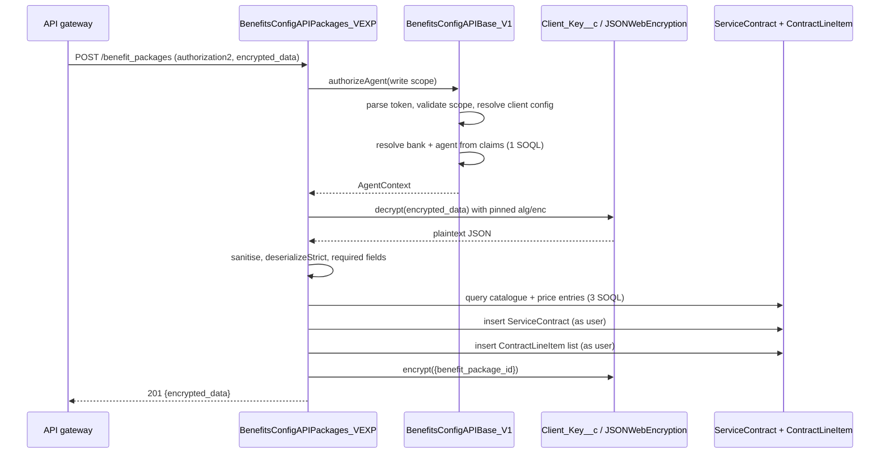
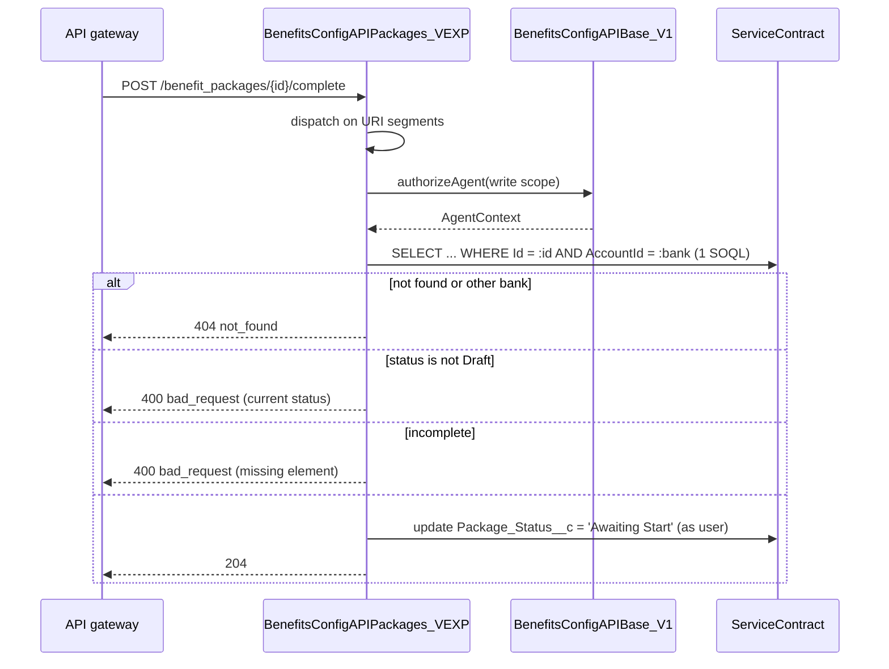

# Benefits Configuration Endpoints Architecture - Back-end

| Status | Domain | Author | Date | Version |
|---|---|---|---|---|
| Draft | Integration / Security | Adilson Arcoverde — Application Architect | 2026-07-25 | 1.4 |

---

## Decision context

The `benefits_configuration` API family is implemented **inside Salesforce** as inbound Apex REST
resources, published to issuer bank agents through the API gateway. Nine operations across four
resources are in scope, all defined by contracts already fixed by the API governance team:

| Resource | Operation | Purpose |
|---|---|---|
| `benefit_packages` | `POST` | Create a package in `DRAFT`. |
| `benefit_packages` | `GET` | List the packages, paginated. |
| `benefit_packages/{benefit_package_id}` | `GET` | Retrieve one package in full. |
| `benefit_packages/{benefit_package_id}` | `PATCH` | Update a package. |
| `benefit_packages/{benefit_package_id}/cancel` | `POST` | Cancel a package. |
| `benefit_packages/{benefit_package_id}/complete` | `POST` | Submit a package and let it await its start date. |
| `products` | `GET` | Return the catalogue of products with their core and optional benefits and prices. |
| `banks/{bank_id}` | `GET` | Return an issuer bank. |
| `banks/{bank_id}/agents/{agent_id}` | `GET` | Return the connected agent. |

The persistence model these operations read and write is decided in
`20260725-AXA-ADR-VOBP-architecture-of-benefit-packages-data-model-backend.md`. This document
does not restate it; it specifies the request pipeline, the authorization flow, the behaviour of
each operation and the error contract.

**The agreement signature capability is not part of this family.** Document generation, the DocuSign
envelope and the inbound envelope-status webhook are decided in
`20260725-AXA-ADR-VOBP-architecture-of-agreement-signature-backend.md`. That webhook is a **tenth
inbound resource that deliberately shares nothing with the nine above**: a different path
(`/v1/docusign/envelope_status`), a different host — a public Site with a guest user rather than the
API gateway — a different authentication scheme (HMAC over the payload, not a bearer token with
scopes), no message-level encryption, and no write to any sObject. Reading it as a tenth operation of
this family would import the wrong security assumptions in both directions.

### Confirmed premises

1. **Salesforce is the system of record.** No outbound call participates in any of the nine
   operations. There is no Named Credential and no external service class in this solution.
2. **The actor is an issuer bank agent** whose identity arrives as custom claims in the access
   token, following the pattern already established by `WebportalAPITokenAuthentication_v1`
   (`tokenData.customData`). The agent is not a Salesforce user.
3. **Message-level encryption is mandatory** on every request body and every response body, using
   the same mechanism as `WebportalCustomerAPI_V3`: `JSONWebEncryption` with per-client keys in
   `Client_Key__c`.
4. **The Apex URL mapping mirrors the gateway path literally, including the `vexp` segment.**
5. **`PATCH` is accepted only while the package is in `DRAFT`, and the benefit collections are
   replaced wholesale**, never merged.
6. **`amount_of_policies` is accepted as declared** and is not validated against card data.

### The existing pipeline this solution extends

`WebportalCustomerAPI_V3` and its base `WebportalCustomerAPIBase_V1` define the house pattern for
inbound REST in this org, and it is reused rather than reinvented:

1. `isAuthenticated(Set<String> requiredScopes)` — parses and validates the token, resolves the
   client configuration, and **writes the error response itself** when it fails, returning
   `false`. The caller checks the boolean and stops. No exception crosses the boundary.
2. `WebportalAPITokenAuthentication_v1.parseAndValidateSecurityToken` — reads the bearer token,
   splits the three JWT segments, decodes the payload, and validates that at least one required
   scope is present, throwing `RequestAPIException(403, 'forbidden', ...)` otherwise.
3. `WebportalAPITokenAuthentication_v1.getClientConfiguration` — resolves `api_client_access__c`
   by `client_id__c = tokenData.aud` and throws `403` unless exactly one record matches.
4. `validateClientAccess(...)` — the row-level check, historically comparing
   `tokenData.customData.cn` against the cardholder's `Customer_Identifier__c`.
5. Body handling — JWE decrypt, `fixJson`, `removeXMLInjections`, `removeHtmlInjection`,
   `JSON.deserializeStrict`, then required-field validation.
6. Errors — `WebportalApiUtility_v1.APIError` / `ErrorMessage`, serialised as
   `status_code` / `error` / `error_description`.

### Problems in the current state that motivate the decision

1. **The row-level check has no notion of a bank or an agent.** Every overload of
   `validateClientAccess` is written around a cardholder (`customData.cn`, `Customer_Identifier__c`,
   `MN_Account_BIN__c`, `partner_cd__c`). None of them can authorise an agent acting on behalf of
   an issuer, which is the only actor of this family.
2. **The scope family is new.** The existing classes hard-code scopes such as
   `urn:axa.partners.specific.visagateway.customers.write`. The contracts here declare
   `urn:axa.partners.sales.enterprise.transversal.benefits_configuration.*`, in four independent
   sub-families with separate read and write rights.
3. **`isAuthenticated` returns a boolean and writes the response as a side effect**, which
   `WebportalCustomerAPI_V3` then re-checks with `Test.isRunningTest()` guards scattered through
   the business logic. Copying that shape into six new operations would multiply the branching.
4. **Sub-resource routing is not solved anywhere in the family.** Apex REST allows only one
   wildcard, at the end of the mapping, so `/cancel`, `/complete` and
   `/banks/{bank_id}/agents/{agent_id}` cannot each own a mapping.

---

## Decisions

### 1. Three Apex REST classes, dispatching on the request URI

Apex REST accepts a single trailing wildcard per `urlMapping` and resolves a request to the
class whose static prefix is the longest match. Consequently `/banks/*` would also capture
`/banks/{bank_id}/agents/{agent_id}`, and `/benefit_packages/*` also captures `/cancel` and
`/complete`. The topology follows from that constraint:

| Class | `urlMapping` | Operations served |
|---|---|---|
| `BenefitsConfigAPIPackages_VEXP` | `/sales/enterprise/transversal/benefits_configuration/vexp/benefit_packages/*` | POST create, GET list, GET detail, PATCH, POST cancel, POST complete |
| `BenefitsConfigAPIProducts_VEXP` | `/sales/enterprise/transversal/benefits_configuration/vexp/products` | GET products |
| `BenefitsConfigAPIBanks_VEXP` | `/sales/enterprise/transversal/benefits_configuration/vexp/banks/*` | GET bank, GET agent |

The public path of the contract is served by the gateway; the Salesforce path is the mapping above
prefixed by `/services/apexrest`. The gateway route is therefore
`https://apis.axa-assistance.com/sales/enterprise/transversal/benefits_configuration/vexp/benefit_packages`
→
`/services/apexrest/sales/enterprise/transversal/benefits_configuration/vexp/benefit_packages`.
The `vexp` segment is carried into the Apex mapping deliberately: the mapping is part of the
published contract surface, and a mapping that silently disagreed with the gateway path would make
every routing incident a two-place investigation. The class suffix `_VEXP` follows the same logic
and matches the precedent already in the repository (`WebportalSmartContractClaimComplAPI_VEXP`).
The shared base class is suffixed `_V1` because it is path-independent and outlives the
experimental route.

Within `BenefitsConfigAPIPackages_VEXP`, `@HttpPost` serves three different operations, so the
first action of each verb method is to resolve the operation from the URI, before any
authorization or body work:

```apex
@RestResource(urlMapping='/sales/enterprise/transversal/benefits_configuration/vexp/benefit_packages/*')
global with sharing class BenefitsConfigAPIPackages_VEXP extends BenefitsConfigAPIBase_V1 {

    private static final String RESOURCE_PATH = '/benefit_packages';
    private static final String ACTION_CANCEL = 'cancel';
    private static final String ACTION_COMPLETE = 'complete';

    @HttpPost
    global static void doPost() {
        RestContext.response.addHeader('Content-Type', 'application/json');
        List<String> segments = getResourceSegments(RESOURCE_PATH);
        if (segments.isEmpty()) {
            handleCreate();
        } else if (segments.size() == 2 && segments[1] == ACTION_CANCEL) {
            handleCancel(segments[0]);
        } else if (segments.size() == 2 && segments[1] == ACTION_COMPLETE) {
            handleComplete(segments[0]);
        } else {
            writeError(404, 'not_found', 'Unknown resource path');
        }
    }
}
```

`getResourceSegments` lives on the base class and returns the path fragments after the resource
name, so the dispatch table of every resource class is a flat comparison with no substring
arithmetic repeated per operation.

### 2. `BenefitsConfigAPIBase_V1` centralises authorization and returns a typed context

The new base class extends `WebportalAPIBase_v1`, like `WebportalCustomerAPIBase_V1` does, and
exposes one entry point per concern. The decisive change from the existing pattern is that
authorization returns a **typed context object** instead of a boolean:

```apex
public abstract with sharing class BenefitsConfigAPIBase_V1 extends WebportalAPIBase_v1 {

    public static AgentContext authorizeAgent(Set<String> requiredScopes) {
        try {
            WebportalAPITokenAuthentication_v1.AccessTokenData tokenData = WebportalAPITokenAuthentication_v1.parseAndValidateSecurityToken(RestContext.Request, requiredScopes);
            WebportalAPITokenAuthentication_v1.getClientConfiguration(tokenData);
            return resolveAgentContext(tokenData);
        } catch (WebportalApiUtility_v1.RequestAPIException ex) {
            writeError(ex.status_code, ex.error, ex.error_description);
            return null;
        }
    }

    private static AgentContext resolveAgentContext(WebportalAPITokenAuthentication_v1.AccessTokenData tokenData) {
        String bankReference = getBankClaim(tokenData);
        String agentReference = getAgentClaim(tokenData);
        if (String.isBlank(bankReference) || String.isBlank(agentReference)) {
            throw new WebportalApiUtility_v1.RequestAPIException(403, 'forbidden', 'Access token does not identify a bank agent');
        }
        List<Contact> agents = [SELECT Id, AccountId, Account.CurrencyIsoCode FROM Contact WHERE Id = :agentReference AND AccountId = :bankReference AND Is_Benefits_Configuration_Agent__c = true WITH USER_MODE LIMIT 1];
        if (agents.isEmpty()) {
            throw new WebportalApiUtility_v1.RequestAPIException(403, 'forbidden', 'The agent is not authorized to operate benefit packages for this bank');
        }
        return new AgentContext(agents[0], tokenData.aud);
    }

    public class AgentContext {
        public Id agentContactId;
        public Id bankAccountId;
        public String baseCurrency;
        public String clientId;

        private AgentContext(Contact agent, String clientId) {
            this.agentContactId = agent.Id;
            this.bankAccountId = agent.AccountId;
            this.baseCurrency = agent.Account.CurrencyIsoCode;
            this.clientId = clientId;
        }
    }
}
```

A `null` return means the error response is already written and the caller must stop — the same
convention as `isAuthenticated`, with the difference that success carries data. This removes the
second token parse that `WebportalCustomerAPI_V3.handlePost` performs (it calls
`isAuthenticated`, then `parseAndValidateSecurityToken` again, then `getAccessTokenData` a third
time to read `customData.cn`). One parse per request is both faster and the only way to be sure
the three reads agree.

`WebportalCustomerAPIBase_V1.isAuthenticated` is left untouched. Existing consumers of that class
are not migrated by this solution.

### 3. Token transport and claim resolution

| Item | Value |
|---|---|
| Header | `authorization2` |
| Scheme | `Bearer ` prefix, case-insensitive |
| Format | JWT, three dot-separated segments; the payload segment is base64url-decoded |
| Client identity | `aud` claim → `api_client_access__c.client_id__c` and `Client_Key__c.ClientID__c` |
| Bank identity | custom claim, read through `getBankClaim` |
| Agent identity | custom claim, read through `getAgentClaim` |

The header is `authorization2`, not `Authorization`: the platform consumes `Authorization` for its
own session handling on Apex REST, so the family has always carried the caller's bearer token in a
secondary header. The gateway must map it accordingly. A missing or malformed header yields `401`;
`WebportalAPITokenAuthentication_v1.getAccessTokenData` already implements exactly this behaviour
and is reused unchanged.

The **names** of the bank and agent claims are owned by the identity provider and are
`[to be confirmed]` with the AXA IAM team. They are isolated behind `getBankClaim` and
`getAgentClaim` on the base class, so confirming them changes two private methods and nothing
else. Until confirmation, both read from the `customData` structure that
`AccessTokenData` already exposes, which is where `cn` lives today.

The token is **not** cryptographically verified inside Apex — the gateway performs signature and
issuer validation before forwarding, exactly as it does for the existing family. This is recorded
as R2 rather than re-implemented, because a second verification in Apex would need the issuer's
public keys in the org and would duplicate a control that already exists upstream.

### 4. Scope matrix

One scope per operation, matching the contracts. Both declared security schemes
(`dev_visabenefits_acg`, `test_visabenefits_acg`) publish the same URN, so a single set per
operation covers both environments and no environment branching enters the code.

| Operation | Required scope |
|---|---|
| POST `/benefit_packages` | `urn:axa.partners.sales.enterprise.transversal.benefits_configuration.benefit_packages.write` |
| GET `/benefit_packages` | `...benefit_packages.read_only` |
| GET `/benefit_packages/{id}` | `...benefit_packages.read_only` |
| PATCH `/benefit_packages/{id}` | `...benefit_packages.write` |
| POST `/benefit_packages/{id}/cancel` | `...benefit_packages.write` |
| POST `/benefit_packages/{id}/complete` | `...benefit_packages.write` |
| GET `/products` | `...products.read_only` |
| GET `/banks/{bank_id}` | `...banks.read_only` |
| GET `/banks/{bank_id}/agents/{agent_id}` | `...banks.agents.read_only` |

Scopes are declared as `private static final Set<String>` constants on the resource class that
uses them, one constant per operation. A read scope never authorises a write operation, and the
write scope does not imply the read scope — the contracts declare them independently and the code
does not widen them.

### 5. Row-level authorization: the bank predicate is mandatory on every query

The integration identity can technically see every package in the org, so isolation cannot come
from sharing (analysed in decision 13 of the data model document). It comes from a predicate that
is present in every single query of this family:

| Operation | Row-level rule |
|---|---|
| POST `/benefit_packages` | `AccountId` is set from `context.bankAccountId`; a body-supplied bank is ignored. |
| GET `/benefit_packages` | `WHERE AccountId = :context.bankAccountId` |
| GET, PATCH, cancel, complete on `{id}` | `WHERE Id = :packageId AND AccountId = :context.bankAccountId` |
| GET `/products` | Filtered by the bank's eligible portfolio; unrestricted catalogue reads are not exposed. |
| GET `/banks/{bank_id}` | `bank_id` from the path must equal `context.bankAccountId`, otherwise `403`. |
| GET `/banks/{bank_id}/agents/{agent_id}` | Both path values must equal the context, otherwise `403`. |

The single-record operations combine the identifier and the bank in **one** query. Querying by Id
and then comparing the bank in Apex would distinguish "exists but belongs to another bank" from
"does not exist" through response timing and through the error path, which is an enumeration
oracle. With the predicate inside the query, both cases return the same `404`:

```apex
List<ServiceContract> packages = [SELECT Id, Package_Status__c, StartDate, EndDate, Amount_of_Policies__c FROM ServiceContract WHERE Id = :packageId AND AccountId = :context.bankAccountId WITH USER_MODE LIMIT 1];
```

For `banks` and `agents` the contract makes the identifier explicit in the path, so a mismatch is
a genuine authorization failure and returns `403` with no information about whether the requested
bank exists.

### 6. Message-level encryption is mandatory in both directions

Every request body is a JWE and every response body is a JWE, wrapped in the `EncryptedPayload`
schema the contracts declare through `oneOf`. The mechanism is the one already in production in
`WebportalCustomerAPI_V3.handlePost`:

1. Resolve `Client_Key__c` by `ClientID__c = context.clientId`.
2. Build the JOSE header from the **stored** key record: `alg` from `CEK_Scheme__c`, `enc` from
   `Encryption_Scheme__c`, `kid` from `KID__c`.
3. When `CEK_Scheme__c = 'dir'`, set the content encryption key from `Mac_Key__c + AES_Key__c` and
   the initialisation vector from `AES_IV__c`. Otherwise deserialise `Private_RSA_Key__c` into a
   `JSONWebEncryption.JWK` and set it as the CEK algorithm key.
4. Deserialise the inbound body strictly into `EncryptedData`, decrypt `encrypted_data`, then run
   the sanitisation chain of decision 7.
5. Serialise the response payload, encrypt it with the same key material, and return
   `{"encrypted_data": "..."}`.

The algorithms are **pinned from the key record, never read from the inbound JOSE header**. An
attacker-supplied header must not be able to select the algorithm — that is the algorithm
confusion class of attack, and the existing implementation already avoids it by construction.
This document makes the property explicit so it survives future refactoring.

`JSONWebEncryption` is used as-is. Re-implementing any part of JWE in this solution is prohibited.
A client without a `Client_Key__c` record is a configuration error, not a fallback to plaintext:
the request fails with `403 forbidden` and an error description stating that message-level
encryption is not configured for the client.

### 7. Request validation and sanitisation pipeline

Applied in this order, on the decrypted body, before any business logic:

| Step | Mechanism | Rejection |
|---|---|---|
| Well-formed envelope | `JSON.deserializeStrict` into `EncryptedData` | `400 bad_request`, `Invalid JSON body` |
| Decryption | `JSONWebEncryption.decrypt` | `400 bad_request`, `Invalid JSON body` |
| Numeric/currency key normalisation | `parseJSON` / `formatJSON` from the existing base | — |
| Markup injection | `WebportalApiUtility_v1.removeXMLInjections`, `removeHtmlInjection` | sanitised, not rejected |
| Unknown attributes | `JSON.deserializeStrict` into the request contract class | `400 bad_request` |
| Required attributes | `validateRequiredFields(body, requiredFields)` | `400 bad_request`, `Field {name} is required` |
| Value domain | Apex, per operation | `400 bad_request` with the offending attribute named |

`deserializeStrict` is what enforces `additionalProperties: false`, which every schema in the four
contracts declares. It is the cheapest possible implementation of that constraint and it fails
before any query runs.

The required-attribute sets are constants on the resource class, mirroring the contract's
`required` lists:

```apex
private static final Set<String> CREATE_REQUIRED_FIELDS = new Set<String>{
    'active_end_at',
    'active_start_at',
    'affected_policy_range',
    'affected_policy_range.external_number_start_at',
    'affected_policy_range.external_number_end_at',
    'amount_of_policies',
    'core_benefits',
    'product_reference'
};
```

`benefit_package_id` is absent from that set although the contract lists it as required, because
the same contract marks it `readOnly`. The handler ignores the attribute when present and never
demands it. The contradiction is raised as R3 of the data model document.

Contract classes are inner classes at the end of each resource class, with attributes in
`snake_case` matching the payload exactly, named `{Operation}Request` and `{Operation}Response`.

### 8. POST `/benefit_packages` — create

Response `201` with `{"benefit_package_id": "<18-char Id>"}`, encrypted.

Flow, after authorization and body validation:

1. Resolve the catalogue: `Product__c` by `Key__c`, then the `Benefit__c` records by
   `Visa_External_Reference__c IN :benefitIds` for every `benefit_id` in `core_benefits` and
   `optional_benefits`, then the active `PricebookEntry` for each benefit in the bank's
   `CurrencyIsoCode`. Three queries, all bulk, all outside any loop. A `benefit_id` that resolves to
   nothing yields `400 bad_request` naming the attribute; a benefit with no active price entry yields
   `400 bad_request` stating that the benefit is not available for the bank's currency.
2. Resolve the BIN: the referenced `VG_BankIdentificationNumber__c` must exist, carry
   `Status__c = 'Approved'` and have `Bank__c` equal to the caller's bank. The BIN is mandatory on
   the package, so a missing, unapproved or foreign BIN yields `400 bad_request`; the *Without BIN*
   state the prototype drew is not supported.
3. Coerce `active_start_at` to today when it is in the past, per the contract note.
4. Build the `ServiceContract` in `Draft`, with `AccountId` and `ContactId` from the agent context
   and `Pricebook2Id` set to the benefits price book.
5. Insert the header, then insert the lines — one `ContractLineItem` per benefit, `Quantity` set to
   `amount_of_policies`, `Benefit_Category__c` set from which collection the benefit came from.

Two DML statements in one transaction. There is a single point of persistence and atomicity comes
from the Apex transaction itself: an exception on the line insert rolls the header back with no
savepoint. A savepoint would add a governor-limited resource for no behavioural gain.



### 9. GET `/benefit_packages` — list

Response `200` with a bare JSON array of `SimplifiedBenefitPackage`, encrypted.

- `start_index` defaults to `0`, `max_results` defaults to `100` and is capped at `100` by the
  contract. Both are validated as integers within range; out-of-range yields `400`.
- Translated to `LIMIT :maxResults OFFSET :startIndex`, ordered by `CreatedDate DESC` so
  pagination is stable and the newest packages surface first.
- `OFFSET` in SOQL is hard-limited to 2000 by the platform. A `start_index` above 2000 returns
  `400 bad_request` stating the pagination limit rather than a platform exception. With
  `max_results` capped at 100, the reachable window is the 2100 most recent packages of a bank;
  beyond that the contract offers no cursor and no filter to narrow the set.
- The response carries no total count, because `BenefitPackageList` has no envelope. A consumer
  cannot compute the number of pages from the response; it detects the end by receiving fewer than
  `max_results` items. Recorded as R4.

One query, single line, selective on `AccountId`, with the fields of `SimplifiedBenefitPackage`
plus the status:

```apex
List<ServiceContract> packages = [SELECT Id, Package_Status__c, Product_Reference__c, StartDate, EndDate, Amount_of_Policies__c FROM ServiceContract WHERE AccountId = :context.bankAccountId AND RecordType.DeveloperName = 'Benefit_Package' WITH USER_MODE ORDER BY CreatedDate DESC LIMIT :maxResults OFFSET :startIndex];
```

### 10. GET `/benefit_packages/{benefit_package_id}` — detail

Response `200` with `BenefitPackage`, encrypted; `404` when the identifier does not resolve within
the caller's bank.

Two queries: the header with the bank predicate, then the lines with the benefit catalogue fields
in a single traversal. `core_benefits` and `optional_benefits` are split from
`Benefit_Category__c` while building the response, so one query serves both collections.
`description` is serialised only for optional benefits, matching the contract, where `CoreBenefit`
has no description attribute.

An identifier that is not a well-formed Salesforce Id yields `400 bad_request` before the query
runs — a malformed Id in a bind variable raises a platform exception that would otherwise surface
as `500`.

### 11. PATCH `/benefit_packages/{benefit_package_id}` — update

Response `204` with no body.

- Accepted **only** when `Package_Status__c = 'Draft'`. Any other status yields
  `400 bad_request` with an error description naming the current status. `403` is not used here:
  the caller holds the right scope and the right bank, the resource state is what forbids the
  operation.
- Attributes present in the body are applied; absent attributes are left untouched.
- `core_benefits` and `optional_benefits`, **when present**, replace the corresponding lines
  entirely: the existing lines of that category are deleted and the submitted set is inserted.
  Merge semantics were discarded because the contract offers no removal operation, so a merge
  would make it impossible to deselect a benefit the agent had previously chosen — the New package
  flow lets an agent toggle optional benefits freely.
- Sending an empty array is a rejection, not a clearing: the contract declares `minItems: 1` for
  both collections. Clearing every core benefit would produce a package that can never be
  completed.
- `benefit_package_id` and `status` in the body are ignored; both are `readOnly`.

Delete plus insert of the lines runs in the same transaction as the header update. Where a package
carries the contract maximum of 100 core and 100 optional benefits, a full replacement is 200 rows
deleted and 200 inserted — well inside DML row limits, and the reason the operation stays
synchronous.

### 12. POST `/cancel` and POST `/complete`

Both respond `204` with no body and both take no request body, so neither runs the decryption
step; only the response of an error is encrypted-free JSON, per the error contract.

| Operation | Allowed from | Effect |
|---|---|---|
| `/cancel` | `Draft`, `Awaiting Start`, `Active` | `Package_Status__c = 'Cancelled'`, `Cancelled_At__c = now`, `Cancelled_By__c = context.agentContactId` |
| `/complete` | `Draft` only | Validates completeness, then `Package_Status__c = 'Awaiting Start'`, `Completed_At__c = now`. Does **not** record agreement acceptance and does **not** require a signed agreement — the signature gates activation, not completion |

`/complete` is where the contract's structural requirements are finally enforced, because a draft
is legitimately incomplete: at least one `Core` line, `Product_Reference__c` present,
`Amount_of_Policies__c` at least 1, both dates present with `EndDate > StartDate`, the account
range present, and the BIN present, approved and owned by the caller's bank. Each failure yields
`400 bad_request` naming the missing element.

Neither operation is idempotent by the contract, which offers no `409`. Re-invoking `/cancel` on an
already-cancelled package returns `400 bad_request` stating the current status, and the same for
`/complete` outside `Draft`. This is deliberate: silently returning `204` for a no-op would hide a
consumer defect, and the terminal states of the model forbid the transition anyway.



### 13. GET `/products`, GET `/banks/{bank_id}`, GET `/banks/{bank_id}/agents/{agent_id}`

**`/products`** returns the catalogue as `ProductsList`, filtered by the optional
`product_reference` query parameter matched against `Product__c.Key__c`. Source: `Product__c` joined
to `Benefit__c`, with `PricebookEntry` supplying `cost`. Every `benefit_id` in the response is
`Benefit__c.Visa_External_Reference__c`, `name` is `Name` and `description` is
`Benefit_Description__c`. The three coverage shapes of the contract (`SimpleCost`, `UsageCoverage`,
`PeriodCoverage`) are selected from `Coverage_Type__c` on the catalogue side and serialised as the
matching inner class; a benefit whose coverage type has no price entry in the bank's
`CurrencyIsoCode`, or whose `Visa_External_Reference__c` is null, is omitted from `optional_benefits`
rather than returned unusable — a `cost` without a currency cannot feed the flow's estimate, and a
benefit without an external reference cannot be selected on the way back in. Both omissions are
logged, so a shrinking catalogue is diagnosable without a customer report. Two queries, both bulk,
capped at the contract's `maxItems: 100`.

**`/banks/{bank_id}`** returns `Bank` from `Account`: `bank_name` from `Name`, `country` from
`BillingCountryCode`, `base_currency` from `CurrencyIsoCode`. The path `bank_id` must equal
`context.bankAccountId`.

**`/banks/{bank_id}/agents/{agent_id}`** returns `Agent` from `Contact`. The contract calls it
"the connected agent", and the authorization context already resolved exactly that record in
decision 2, so the operation performs **one** query for the name and email fields and reuses the
resolved context for the authorization check. Both path values must match the context.

`BenefitsConfigAPIBanks_VEXP` serves both, dispatching on segment count: one segment is the bank,
three segments with `agents` in the middle is the agent, anything else is `404`.

### 14. Error contract and HTTP status mapping

Every error body is the existing shape, so consumers of the family need no new parser:

```json
{ "status_code": "403", "error": "forbidden", "error_description": "..." }
```

| Status | `error` | Raised when |
|---|---|---|
| `400` | `bad_request` | Malformed JSON, failed decryption, unknown attribute, missing required attribute, value out of domain, malformed identifier, pagination out of range, operation not allowed from the current status |
| `401` | `unauthorized` | `authorization2` header missing, wrong scheme, or not three JWT segments |
| `403` | `forbidden` | Required scope absent, client not registered in `api_client_access__c`, no `Client_Key__c` for the client, token does not identify a bank agent, agent not entitled, path identifier does not match the caller's bank |
| `404` | `not_found` | Package identifier does not resolve within the caller's bank; unknown resource path |
| `500` | `internal_server_error` | `DmlException`, `QueryException`, or any unhandled exception |

Scope failure is `403`, not `401`: the caller is authenticated and the token is valid, the grant is
insufficient. This matches the behaviour already implemented in
`WebportalAPITokenAuthentication_v1.validateRequiredScopes`.

Internal errors never leak a stack trace, a query, a field API name or a record Id. The
`error_description` of a `500` is a fixed string per operation; diagnosis relies on the debug log
and on the `Client_Id__c` attribution of the affected record.

`RequestAPIException` is caught at the boundary of each handler, never swallowed inside business
logic. `DmlException` and `QueryException` are caught specifically; a bare `catch (Exception)`
appears only in the outermost handler of each operation, whose sole job is to produce the `500`.

### 15. Performance budget against the declared SLA

The contracts declare `x-satisfactory-response-time` of **250 ms for reads** and **500 ms for
writes**. That budget is tight for Apex REST with message-level encryption, so the design commits
to a fixed query count per operation:

| Operation | SOQL | DML | JWE operations |
|---|---|---|---|
| POST create | 4 (agent, product, benefits, price entries) | 2 | 1 decrypt + 1 encrypt |
| GET list | 2 (agent, packages) | 0 | 1 encrypt |
| GET detail | 3 (agent, header, lines) | 0 | 1 encrypt |
| PATCH | 4 | 3 (update, delete lines, insert lines) | 1 decrypt + 1 encrypt |
| cancel / complete | 2–3 | 1 | 1 encrypt |
| GET products | 3 | 0 | 1 encrypt |
| GET bank / agent | 2 | 0 | 1 encrypt |

Rules that keep those counts stable: no SOQL and no DML inside a loop; one token parse per
request; every query bounded by `LIMIT` and selective on an indexed field; the catalogue resolved
in bulk by `Set<Id>` rather than per benefit. The most expensive read is the package detail with
its 100-plus lines, and the most expensive write is a full PATCH replacement of 200 lines. Both
are inside platform limits with substantial margin, but neither is inside 250 ms with certainty —
which is why the SLA is recorded as R1 rather than asserted as met.

Message-level encryption is the single largest non-query cost, and it is not negotiable
(decision 6). Load testing against the real key configuration, before the contract is published,
is a next step.

### 16. Test strategy

One test class per production class, suffixed `Test`: `BenefitsConfigAPIBase_V1Test`,
`BenefitsConfigAPIPackages_VEXPTest`, `BenefitsConfigAPIProducts_VEXPTest`,
`BenefitsConfigAPIBanks_VEXPTest`, plus `ServiceContractStatusPromotionBatchTest` and
`ServiceContractTriggerHandlerTest` for the model side.

- `@TestSetup` builds the shared fixture: an issuer `Account`, an entitled `Contact`, a second
  bank with its own package for the isolation tests, the catalogue with price entries, and a
  `Client_Key__c` with a `dir` scheme so the JWE path is exercised without RSA material.
- `RestContext.request` and `RestContext.response` are constructed per test method, with the
  `authorization2` header carrying a locally built unsigned JWT — the platform never verifies the
  signature (decision 3), so no secret is needed in test data.
- No `SeeAllData=true`. No hard-coded record Id. No real credential, key or token, including in
  test data: `Client_Key__c` fixtures carry values generated inside the test method.
- Mandatory negative coverage per operation: missing header (`401`), wrong scope (`403`),
  unregistered client (`403`), **package belonging to another bank (`404`)**, malformed identifier
  (`400`), status not permitting the operation (`400`), unknown attribute in the body (`400`).
  The cross-bank case is the one that protects decision 5 and is required in every single-record
  operation's test class.
- Method names state the behaviour: `testHandleComplete_WhenStatusIsNotDraft_Returns400()`.
- Target coverage 90 percent, floor 75.

The `Test.isRunningTest()` branches that `WebportalCustomerAPI_V3` embeds in its business logic are
**not** reproduced. Production behaviour that differs under test hides defects; the fixture is
built so the real path runs.

### 17. Deployment prerequisites

1. Entitlement Management and Contract Line Items enabled — the objects this API writes do not
   exist otherwise.
2. `api_client_access__c` record for each consuming client, with the `json_config__c` access
   configuration.
3. `Client_Key__c` record for each consuming client, with the scheme, key material and `KID__c`.
4. Permission sets of decision 13 of the data model document assigned to the integration
   identity, including FLS on every field the API reads or writes. A missing FLS grant surfaces as
   a `QueryException` under `WITH USER_MODE`, which the handler maps to `500` — so the assignment
   is verified as part of the deployment checklist, not discovered in production.
5. Gateway route mapping the public contract path to `/services/apexrest` plus the mapping of
   decision 1, and forwarding the caller's bearer token in `authorization2`.
6. `ServiceContractStatusPromotionSchedulable` scheduled once per day.

---

## Risks

**R1 — The 250 ms / 500 ms SLA is not demonstrated.** Mandatory message-level encryption plus
Apex REST overhead consume a large share of the budget before the first query runs, and the
package detail response can carry 200 benefit lines. Mitigation: the fixed query counts of
decision 15, and load testing against the real key configuration before publication. If the
budget cannot be met, the negotiable levers are the response shape and the encryption scheme —
both require agreement from the API owner.

**R2 — Token signature is not verified inside Apex.** The org trusts the gateway to validate the
signature, the issuer and the expiry. A request reaching the Apex endpoint by any path that
bypasses the gateway would be authorised on the strength of a decoded, unverified payload.
Mitigation: this is the pre-existing posture of the whole `Webportal*` family and is not made
worse here; the Salesforce endpoint must be reachable only through the gateway, which is a
network and connected-app configuration matter for the security team to confirm.

**R3 — The bank and agent claim names are unconfirmed.** `[to be confirmed]` with the AXA IAM
team. Mitigation: both reads are isolated in `getBankClaim` and `getAgentClaim` on the base class;
until confirmation the endpoints cannot be integration-tested against the real identity provider.

**R4 — The list response has no total count and pagination is bounded at `OFFSET` 2000.**
`BenefitPackageList` is a bare array, so a consumer cannot know how many pages exist, and no
filter is offered to narrow a bank's set. A bank with more than 2100 packages has records it
cannot reach through the API. Mitigation: recorded and raised with the API owner; a filter by
status or by date range in a future contract version resolves both.

**R5 — Three operations share one `@HttpPost`.** Dispatch is string-based on the URI, so a typo in
a path segment is a `404` produced by this solution rather than by the gateway, and a future
sub-resource added to the contract silently falls into the `404` branch until the dispatch table
is updated. Mitigation: the dispatch table is a flat, exhaustive comparison with an explicit
`else` that returns `404`, and each branch is covered by a test.

**R6 — `PATCH` replaces benefit collections wholesale.** A consumer that sends a partial body
believing the semantics are incremental removes every benefit it omitted. The contract does not
declare the semantics either way. Mitigation: documented behaviour, `minItems: 1` enforced so the
collections can never end up empty, and the distinction made explicit in the consumer-facing API
documentation.

**R7 — A client without `Client_Key__c` gets `403`, not plaintext.** Correct by decision 6, but it
turns a configuration gap into a total outage for that client, with an error that looks like an
authorization problem. Mitigation: the `error_description` states explicitly that message-level
encryption is not configured for the client, and prerequisite 3 of decision 17 is part of the
onboarding checklist for every consumer.

**R8 — Identifier validation before binding.** A malformed value in the `{benefit_package_id}`
position raises a platform exception when bound to an `Id` field, which would surface as `500`.
Mitigation: shape validation before every query, returning `400`; covered by a dedicated test in
each single-record operation.

**R9 — `/products` omits benefits with no price in the bank's currency.** The catalogue response
silently shrinks when a price entry is missing, so an agent cannot select a benefit that exists
and the cause is invisible from the API. Mitigation: the catalogue sync of the data model document
runs as a reconciliation job, and the omission is logged so the gap is detectable without a
customer report.

**R10 — The `vexp` segment is in the published path and in the Apex mapping.** When the contract
graduates out of experimental, the path changes, the Apex mapping changes and the class names stop
matching. Mitigation: the base class is `_V1` and carries all reusable logic, so graduation adds
thin resource classes on the new mapping and the experimental ones can be retired without touching
the authorization or encryption pipeline.

---

## Next steps

1. Confirm with the AXA IAM team the exact claim names carrying the bank and agent identity, and
   confirm that the gateway forwards the caller's bearer token in `authorization2` — unblocks R3
   and the whole authorization pipeline.
2. Confirm with the security team that the Apex endpoints are reachable only through the gateway —
   unblocks R2.
3. Load-test the create and detail operations with the real `Client_Key__c` configuration and a
   100-line package against the declared SLA — unblocks R1.
4. Raise with the API owner: the absence of a total count and of any filter on the list operation,
   the `OFFSET` 2000 ceiling, the `readOnly` plus `required` contradiction on
   `benefit_package_id`, and the undocumented `PATCH` collection semantics — unblocks R4 and R6.
5. Complete prerequisites 1 to 5 of decision 17 in the development sandbox, in that order.
6. Produce the requirements set (Epic, Features, PBIs with Gherkin acceptance criteria) from this
   document and from
   `20260725-AXA-ADR-VOBP-architecture-of-benefit-packages-data-model-backend.md`, one PBI per
   operation plus one for the authorization pipeline and one for the encryption pipeline.
7. Produce the front-end architecture document for the New package flow, referencing this document
   by full file name for the contract of each screen transition.
